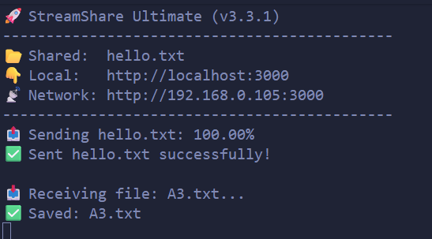
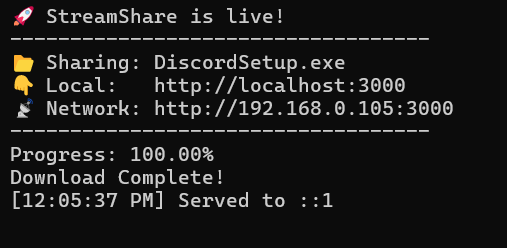

# StreamShare Ultimate 🚀

**The Zero-Dependency, Cross-Platform AirDrop Clone for Developers.**

Instantly stream files, watch videos, and transfer data between your computer and mobile devices over Wi-Fi. Built entirely with **Raw Node.js** (No Express, No Socket.io) to demonstrate high-performance system engineering.


## ❓ Why Should You Use This?

Most file-sharing CLI tools (like `http-server` or `serve`) are "Read-Only." They let you download a file to your phone, but they don't help you get that photo **from** your phone **to** your computer.

**StreamShare is different because:**
1.  **It's Bi-Directional:** You can Drag & Drop files from your phone to upload them back to your computer.
2.  **It's a Media Server:** You don't need to download a 2GB movie to watch it. StreamShare streams it instantly to your browser.
3.  **It's Smart:** You don't need to type file extensions. Type `streamshare start movie` and it finds `movie.mp4`.

## 🆚 How is it different from others?

| Feature | 🚀 StreamShare | 📦 http-server | 🍏 AirDrop |
| :--- | :---: | :---: | :---: |
| **Dependencies** | **0 (Zero)** | 25+ | N/A |
| **Video Streaming** | **Yes (Seek Support)** | No | Yes |
| **Upload to Host** | **Yes (Drag & Drop)** | No | Yes |
| **Cross-Platform** | **Yes (Win/Mac/Linux)** | Yes | No (Apple Only) |
| **Setup Time** | **Instant** | Instant | Instant |

## ✨ Key Features

* **☁️ Universal AirDrop:** A beautiful, responsive Web UI that works on iOS, Android, and Desktop.
* **🎬 In-Browser Streaming:** Watch videos (`.mp4`, `.mkv`) immediately with a Netflix-style player. Supports seeking (rewind/fast-forward) using HTTP Range Requests.
* **🧠 Smart Path Resolution:** Hate typing extensions? Just type the filename (e.g., `resume`), and the tool auto-detects `resume.pdf`.
* **📱 Instant Connect:** Generates a **QR Code** on your screen. Just scan to connect—no typing IP addresses.
* **🤖 Auto-Port Detection:** Never crashes because "Port 3000 is in use." It automatically finds the next free port.
* **⚡ Zero Dependencies:** Built using **only** standard Node.js libraries (`http`, `fs`, `net`, `child_process`).

## 📦 Installation

You can install it globally to use it repeatedly, or run it once using `npx`.

**Option A: Global Install (Recommended)**
```bash
npm install -g streamshare-cli
```
**Option B: Run Once (No Install)**

```bash
npx streamshare-cli start myvideo.mp4
```

 How to Use
Once installed, simply type `streamshare start` followed by what you want to do.

1. **Share a Single File**
Great for quickly sending a document or video to your phone.

Bash
```
streamshare start movie.mp4
```

2. **Share Multiple Files**
You can list as many files as you want.

Bash
```
streamshare start resume.pdf vacation.jpg song.mp3
```

3. **Smart Selection (No Extensions)**
Don't remember if it's .jpg or .png? Just type the name!

Bash
```
# Automatically finds 'photo.png' or 'photo.jpg'
streamshare start photo
```

4. **Receive Mode (Upload Only)** Want to send photos from your phone to your computer? Run the command without any files.

Bash
```
streamshare start
```
Scan the QR code with your phone.

Tap the "Drop Zone" on your phone screen.

Select your photos/videos.

Result: They instantly appear in your terminal's current folder!
---

##  Screenshots

- StreamShare running in the terminal:



- Mobile UI (scan QR & upload):


